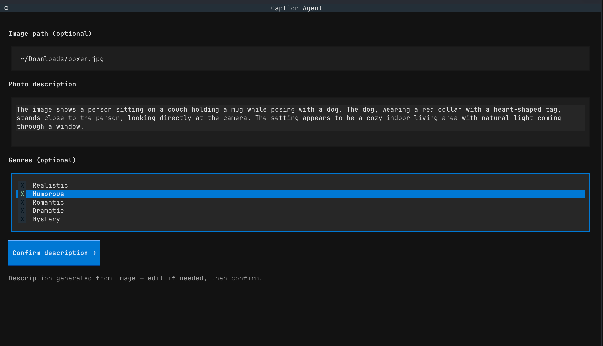
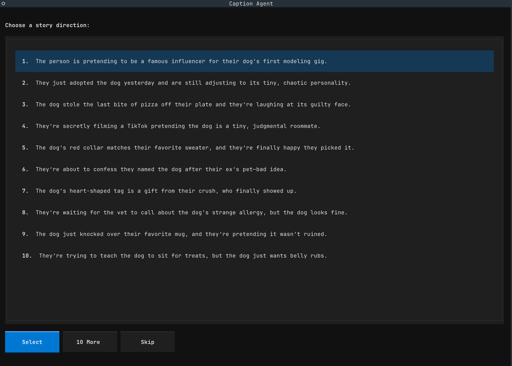
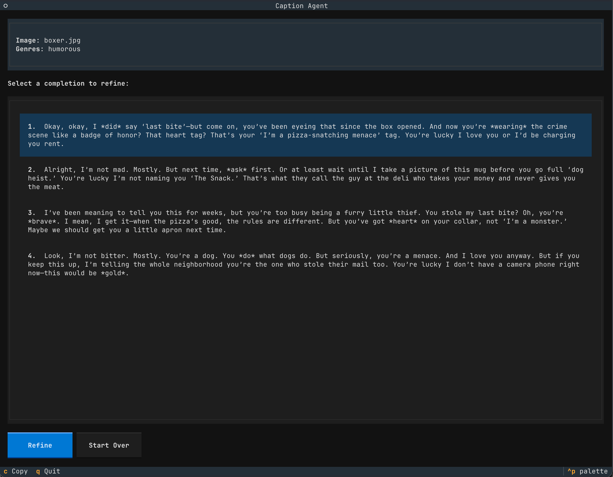

# PhotoCaptionAgent

A multi-stage agentic AI pipeline that turns your photos into captions — using a vision model to see the scene, an LLM to generate story context, and a refinement loop to dial in exactly the tone you want.

Drop in a photo. The vision model describes what it sees. A story-direction agent generates 10 narrative framings. A refinement agent iterates on your pick until it's perfect.  All Ollama,  cloud APIs optional.

Great for tagging photos with something better than "nice pic" — or just making your friends question your emotional depth.

*Step 1 — Vision describes the photo, you pick a genre*


*Step 2 — Pick a story direction*


*Step 3 — Four captions ready to copy, refine, or post*


---

## What it does

You give it a photo (or a description). It runs it through three AI stages:

**Stage 1 — Story direction**
The model generates 10 one-sentence scene narratives — possible backstories for what's happening in the photo. Pick one that fits, ask for 10 more, or skip straight to captions.

**Stage 2 — Dialogue captions**
Four distinct completions, each voiced as if the person in the photo is speaking directly to someone. Four emotional angles:
- Urgent / confrontational
- Tender but firm
- Burdened / heavy
- Raw / unfiltered

**Stage 3 — Refinement**
Pick a caption, give a direction ("make it funnier", "shorter and more deadpan", "sadder"), get 5 variations. Repeat as many times as you like.

Genre styles (humorous, dramatic, romantic, mystery, realistic) are optional and shape the tone across all three stages. The agents are plain Python classes, so the pipeline is easy to script for batch use.

---

## Vision AI

No description? No problem. Drop in an image path and a vision model analyzes the photo and writes a 1–3 sentence description automatically. You can review and edit it before the pipeline starts.

```
~/Downloads/beach-photo.jpg  →  "Two people standing at the edge of the water at dusk,
                                 one looking out at the horizon, the other watching them."
                                 ↓
                             story ideas, captions, refinement
```

Supported formats: JPEG, PNG, WEBP, GIF. Tilde paths (`~/...`) work.

---

## Tech stack

| Component | Technology |
|-----------|------------|
| LLM + Vision | [Ollama](https://ollama.com) API (any model — tested with `gemma3:27b`) |
| Vision analysis | Multimodal model via Ollama's image chat API |
| TUI | [Textual](https://textual.textualize.io) — terminal UI framework |
| HTTP | [ollama-python](https://github.com/ollama/ollama-python) client |
| Runtime | Python 3.14+, [uv](https://github.com/astral-sh/uv) |

Ollama runs locally or via [api.ollama.com](https://api.ollama.com). No OpenAI, no cloud dependency beyond your Ollama setup.

---

## Architecture

### Agent pipeline

Three independent agents, each a thin wrapper around an Ollama chat call:

```
VisionAgent          →  str description (optional, pre-stage 1)
    ↓
StoryIdeaAgent       →  list[str]  (10 one-sentence scene directions)
    ↓
DialogueCompletionAgent  →  list[str]  (4 voiced dialogue captions)
    ↓
RefinementAgent      →  list[str]  (5 variations on a selected caption)
```

Each agent:
- Reads config from environment (`OLLAMA_HOST`, `OLLAMA_MODEL`, etc.)
- Builds a structured system prompt (with optional genre block injected)
- Calls `ollama.Client.chat()` and parses the response
- Is independently testable via smoke tests

### Parsing

LLM output is plain text, not JSON. `parsing.py` handles two formats:
- `parse_story_ideas` — numbered plain-text lines (`1. She is waiting for…`)
- `parse_completions` — numbered quoted dialogue blocks, with three fallback strategies in case the model formats output differently

### TUI

Built with Textual. Five screens connected by shared app state (`CaptionApp`):

```
InputScreen
  │  (type description, or drop image path → VisionAgent describes it)
  ↓
StoryIdeasScreen
  │  (pick one of 10 ideas, ask for 10 more, or skip)
  ↓
ResultsScreen
  │  (4 captions → pick one to refine)
  ↓
RefineScreen
  │  (type a direction → RefinementAgent generates 5 variations)
  ↓
RefinedResultsScreen
     (pick one, refine again, or start over)
```

Workers run on background threads (`@work(thread=True)`) so the TUI stays responsive during API calls. All state mutations happen on the main thread via `call_from_thread`.

### Project layout

```
src/agent_flow/
  agents/
    vision_agent.py              # image → text description
    story_idea_agent.py          # text → 10 story directions
    dialogue_completion_agent.py # story + description → 4 captions
    refinement_agent.py          # caption + instruction → 5 variations
  prompts/
    story_ideas.py               # system prompt for StoryIdeaAgent
    dialogue.py                  # system prompt for DialogueCompletionAgent
    refinement.py                # system prompt for RefinementAgent
  tui/
    app.py                       # CaptionApp — shared state, global CSS
    screens/                     # one file per screen
    widgets.py                   # ContextPanel (persistent summary bar)
  parsing.py                     # LLM output parsers
  refinement_context.py          # RefinementContext dataclass
  genres.py                      # GENRES dict
  config.py                      # DEFAULT_MODEL
```

---

## Setup

**1. Install dependencies**
```bash
uv sync   # requires Python 3.14+
```

**2. Configure environment**
```bash
cp .env.example .env
```
Then edit `.env` and fill in your `OLLAMA_API_KEY` (required for [api.ollama.com](https://api.ollama.com)) and your preferred model. For a local Ollama instance set `OLLAMA_HOST=http://localhost:11434` and leave the key blank.

| Variable | Required | Default | Description |
|---|---|---|---|
| `OLLAMA_HOST` | yes | — | API base URL |
| `OLLAMA_API_KEY` | cloud only | — | API key for api.ollama.com |
| `OLLAMA_MODEL` | yes | — | LLM for all text stages |
| `OLLAMA_TEMPERATURE` | no | `1.0` | Sampling temperature |
| `OLLAMA_VISION_MODEL` | no | `OLLAMA_MODEL` | Multimodal model for image input |

**3. Run**
```bash
uv run python scripts/run_tui.py      # interactive TUI (recommended)
uv run python scripts/run_agent.py    # headless: story ideas → captions
uv run python scripts/run_refine.py   # headless: two refinement rounds
```

---

## Usage

**Text mode** — type a description in the "Photo description" field and click Generate.

**Image mode** — paste a local path into "Image path" (e.g. `~/Photos/birthday.jpg`). The vision model describes the photo. Review the description, edit if needed, then confirm.

**Genres** — select one or more to steer the emotional register. Humorous + dramatic is a surprisingly good combination.

**Keyboard shortcuts**

| Key | Action |
|-----|--------|
| `c` | Copy selected caption to clipboard |
| `q` | Quit |

---

## Tests

Smoke tests make live Ollama API calls and auto-skip when `OLLAMA_API_KEY` is not set.

```bash
uv run pytest tests/smoke/ -v                          # all tests
uv run pytest tests/smoke/test_full_flow.py -v         # full pipeline
uv run pytest tests/smoke/test_vision_agent.py -v      # vision agent
uv run pytest tests/smoke/test_story_idea_agent.py -v
uv run pytest tests/smoke/test_refine_agent.py -v
```

---

## Possible future directions

**Save and export** — no way to persist results yet. A "Save" button that writes captions to a text file, or copies a formatted block ready to paste into your photo app, would make this a proper tool rather than just a demo.

**Batch processing** — run VisionAgent + DialogueCompletionAgent over a folder of images unattended, write captions to sidecar JSON files or directly into EXIF metadata. The headless scripts (`run_agent.py`) are already most of the scaffolding needed.

**Structured output** — the parsing layer has three fallback strategies because LLM output formatting is inconsistent. Ollama supports `format: "json"` and response schemas; switching to structured output would eliminate the entire `parsing.py` module and make every agent more reliable.

**EXIF / metadata writing** — write the selected caption directly into the image file so your photo library (Apple Photos, Lightroom, etc.) picks it up as a title or caption automatically.

**Web UI** — the TUI is great for a local demo but limits the audience. A small FastAPI backend with the same agent pipeline and a browser frontend would make this shareable with non-technical people and usable on mobile.

**Retry on parse failure** — when the LLM returns malformed output the pipeline surfaces an error and you start over. An automatic single retry before giving up would make the tool much less frustrating on flaky models.

**Model comparison** — run the same photo through two different models side by side and pick the better result. Useful for evaluating whether a smaller/faster model is good enough for casual use.

**Multi-photo story mode** — given a set of related photos (a trip, an event), generate a narrative arc across them rather than treating each independently. The story-direction stage already thinks in narrative terms — extending it to a sequence is a natural fit.
